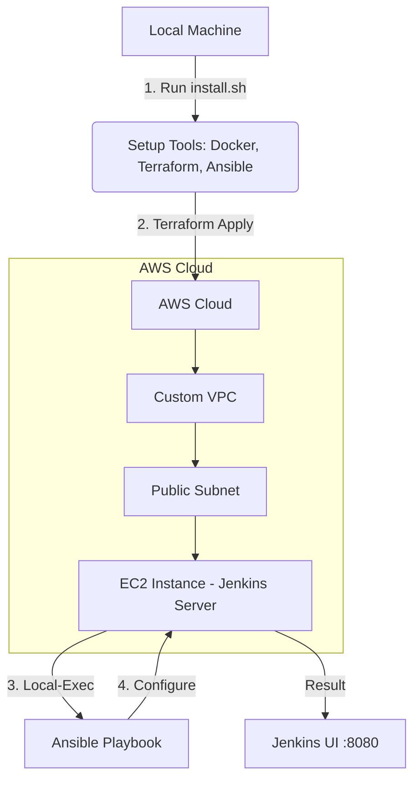

# 🚀 DevOps Automation: Jenkins on AWS with Terraform & Ansible


This project provides a fully automated pipeline to provision and configure a **Jenkins** CI/CD server on **AWS**. It demonstrates the power of combining **Infrastructure as Code (IaC)** with **Configuration Management** to achieve a reliable and repeatable environment.

---

## 🏗️ Architecture Overview

The following diagram illustrates the automated workflow:



---

## 🛠️ Tech Stack & Roles

| Tool | Role | Description |
| :--- | :--- | :--- |
| **Terraform** | Infrastructure | Provisions VPC, Subnets, Security Groups, and EC2 instances. |
| **Ansible** | Configuration | Installs Java, Jenkins, and Nginx; configures services. |
| **Docker** | Containerization | Ready for containerized builds (installed via bootstrap). |
| **AWS** | Provider | Cloud infrastructure provider for hosting the server. |

---

## 🚦 Getting Started

### Prerequisites
- An active **AWS Account**.
- **AWS CLI** configured with credentials (`aws configure`).
- **Ubuntu/Debian** environment (for the bootstrap script).

### 1. Bootstrap Your Environment
Run the provided script to install all necessary tools (Docker, Terraform, Ansible) on your local machine:
```bash
chmod +x install.sh
./install.sh
```

### 2. Prepare SSH Keys
Generate a key pair for secure access to your EC2 instance:
```bash
mkdir -p keys
ssh-keygen -t rsa -b 2048 -f keys/ansible-key -N ""
```

### 3. Provision Infrastructure
Initialize and apply the Terraform configuration:
```bash
cd terraform
terraform init
terraform apply -auto-approve
```
*Note: Terraform will automatically trigger the Ansible configuration for Nginx once the instance is ready.*

### 4. Finalize Configuration
To install Jenkins, run the Ansible playbook manually:
```bash
cd ../ansible
ansible-playbook -i inventory.ini jenkins.yml
```

### 5. Access Jenkins
Once the playbook completes, access Jenkins in your browser:
`http://<EC2_PUBLIC_IP>:8080`

To retrieve the initial admin password:
```bash
ssh -i ../keys/ansible-key ubuntu@<EC2_PUBLIC_IP>
sudo cat /var/lib/jenkins/secrets/initialAdminPassword
```

---

## ☸️ Kubernetes Deployment

This project includes automated K3s installation and Kubernetes manifests for deploying an Nginx application.

### 1. Install K3s on EC2
Use Ansible to set up a lightweight Kubernetes cluster:
```bash
cd ansible
ansible-playbook -i inventory.ini k3s.yml
```

### 2. Deploy Nginx Manifests
Apply the namespace, deployment, and service manifests:
```bash
# SSH into the EC2 instance first
ssh -i ../keys/ansible-key ubuntu@<EC2_PUBLIC_IP>

# Create namespace
kubectl apply -f k8s/namespace.yml

# Deploy Nginx
kubectl apply -f k8s/deployment.yml

# Expose Service
kubectl apply -f k8s/service.yml
```

### 3. Verify Deployment
Check the status of your pods and service:
```bash
kubectl get pods -n my-app
kubectl get svc -n my-app
```
Access the application at `http://<EC2_PUBLIC_IP>:30080`

---

## 🚀 Future Roadmap
- [x] **K3s Setup:** Automated K3s cluster installation.
- [x] **K8s Manifests:** Standardized Deployment, Service, and Namespace files.
- [ ] **EKS Cluster Provisioning:** Update Terraform to create an Elastic Kubernetes Service.
- [ ] **Jenkins-K8s Integration:** Configure Jenkins to use Kubernetes pods as dynamic build agents.
- [ ] **Helm Deployment:** Automate app deployments to K8s using Jenkins pipelines and Helm.

---

## 🛡️ Cleanup
To avoid unwanted AWS costs, destroy the infrastructure when finished:
```bash
cd terraform
terraform destroy -auto-approve
```
